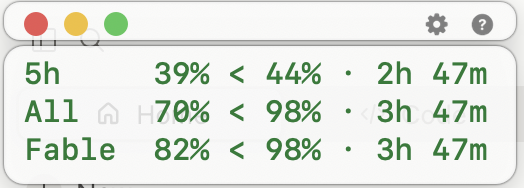

# Overlimit

A floating usage panel for Claude subscription limits on macOS.

It sits above the Claude Desktop window and answers one question the built-in
usage screen does not: **at this pace, will my weekly limit last until reset?**

> Unofficial. Not affiliated with, endorsed by, or sponsored by Anthropic.
> Claude is a trademark of Anthropic, PBC.



Every row reads the same way: **actual | sign | ceiling | time until reset**.
Above, all three are under the even-pace line, so everything is green.

## Why not just look at the remaining percentage

Because "40% left" means nothing on its own. Forty percent with six days to go
is comfortable; forty percent with one day left is a problem. Overlimit compares
your usage against an even-pace line instead.

**Ceiling** = `100 − norm × time until reset`. That is where you would be right
now if you spent evenly. The sign between the two numbers tells you the rest:
`<` means you are under the line, `>` over it, `=` exactly on pace.

- Weekly windows: norm is `100/7 = 14.29` points per day.
- The 5-hour session window: norm is 20 points per hour, computed to the minute.

**Colour** works differently for the two window types, on purpose.

Weekly rows are coloured by *pace*: `k = (remaining ÷ days left) ÷ norm`.
Green at `k ≥ 1.00`, yellow from `0.85`, red below — plus an unconditional red
when less than 10% is left. The yellow threshold is deliberately `1.00` so the
colour changes at exactly the moment the sign flips to `>`.

The session row is coloured by *remaining*, not pace. Inside a five-hour window
pace carries no information: nothing you save is carried over, and everything
resets in a few hours. The only thing that matters is whether you will hit the
wall. Yellow below 35% left, red below 15%.

The metric is self-calibrating: at the start of a window, 100% remaining across
7 days gives exactly the norm, so `k = 1`. No special-casing for Mondays.

## Install

Requires macOS 13+, Xcode Command Line Tools, and Claude Code signed in
(the panel reads its token — see [How it works](#how-it-works)).

```sh
git clone https://github.com/georgyaz/overlimit.git
cd overlimit
./install.sh
```

To remove: `./uninstall.sh` (add `--purge` to delete collected data too).

## Using it

The panel appears when Claude Desktop is in the foreground and hides when you
switch away. Drag it anywhere — the position is remembered.

Hover to reveal the controls: **red** sends it to the Dock, **yellow** hides it
until you come back to Claude, **green** collapses it to a single row. Then a
gear and a help button.

**Right-click** opens everything else: view mode (numbers or bars), which rows
to show, language, theme, font size, opacity, refresh interval, both colour
thresholds, default corner. Numeric settings accept a manual value.

The interface speaks English, Russian, French, Spanish, Portuguese and
Chinese, following the system language by default. Adding another one means a
block in `Sources/Translations.swift` keyed by the English string — anything
missing quietly falls back to English, so a partial translation is fine.

## How it works

Three moving parts:

1. **`snapshot.sh`** — a launchd agent, every 5 minutes. It reads the OAuth
   token Claude Code stores in the macOS keychain (service
   `Claude Code-credentials`), calls Anthropic's usage endpoint, and appends a
   row per limit to `~/.overlimit/usage-log.csv`. Nothing leaves your machine.
2. **`token.py`** — refreshes that token when it expires (roughly hourly) and
   writes it back to the same keychain entry, so the CLI and this tool stay in
   sync. Backs off for 30 minutes on HTTP 429.
3. **The app** — reads the CSV, never the network. It cannot cause rate limits.

Closed windows are recorded in `~/.overlimit/history.csv` for week-over-week
comparison.

## Please read this before installing

**This tool uses an undocumented endpoint and a credential that Anthropic
intends for its own applications.** Their
[Legal and compliance page](https://code.claude.com/docs/en/legal-and-compliance)
states that OAuth authentication is "intended exclusively" for Claude Code and
other native Anthropic applications, that developers building products should
use API keys instead, and that Anthropic "reserves the right to take measures
to enforce these restrictions and may do so without prior notice."

Overlimit does not run inference, does not spend tokens, does not offer
Claude.ai login to anyone, and does not route anything on behalf of other
users. It reads your own usage numbers, on your own machine, with your own
credential — the same numbers the Claude settings screen shows you.

That is the spirit of the rule. It is not obviously the letter of it. In
January 2026 Anthropic began rejecting consumer tokens used elsewhere with
`This credential is only authorized for use with Claude Code`; the usage
endpoint still answers today, but it may stop at any time, and that would be
entirely their prerogative.

Install this only if you are comfortable with that. If you are building a
product rather than watching your own numbers, use an API key instead.

## Known quirks

Things that cost time to find, documented so they cost you none:

- The token lives in the **keychain**, not in `~/.claude/.credentials.json`.
  The keychain entry's `acct` field is your macOS username; writing with a
  different `acct` silently creates a *second* entry while the CLI keeps
  reading the old one — and since refresh tokens rotate, that breaks the CLI.
- `pgrep -f` cannot see the main Claude Desktop process (its arguments are not
  readable under hardened runtime). Detect it via `ps -A -o comm=` instead.
- `resets_at` comes back with different fractional seconds on every call.
  Comparing the strings makes every snapshot look like a window rollover.
- The old top-level fields (`seven_day_sonnet` and friends) are empty. Read the
  `limits` array — that is where per-model windows live, and the tightest one
  is often *not* the overall weekly limit.

## Licence

MIT. See [LICENSE](LICENSE).
